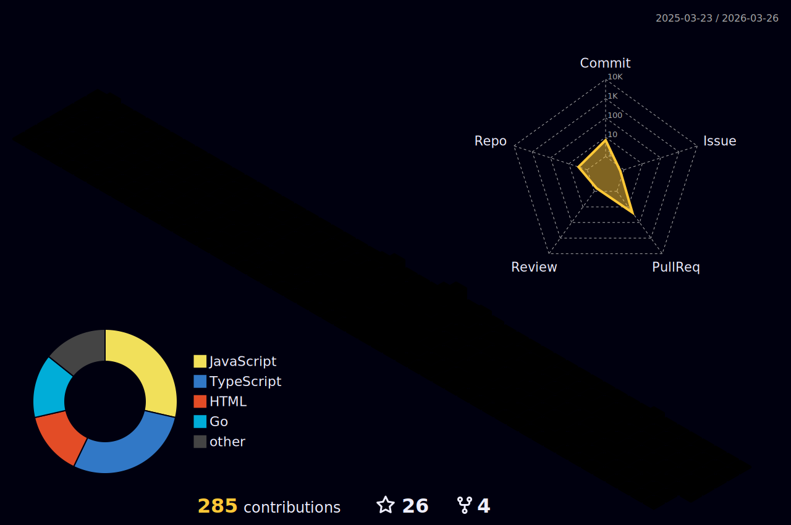
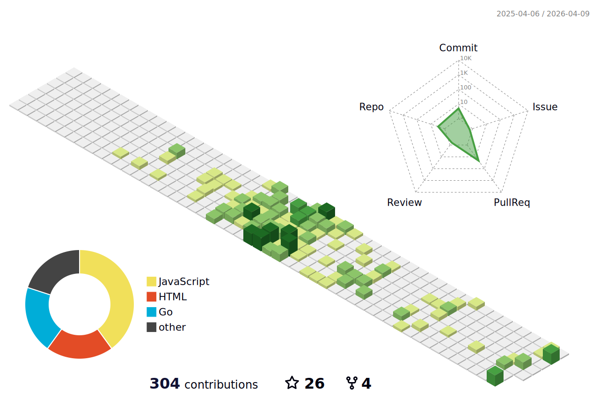

<h1 align="center">
  <b>Prabhav Khera</b>
</h1>
<!--  -->

Hey! I'm Prabhav Khera, candidate of **B. Computer Science(BCS) with Artificial Intelligence Specialization** at University of Waterloo.

## My Stats

 

  

 

  

 

  

    
  

  

   
<!--      -->
    
  

  

<!--
**probro27/probro27** is a ✨ _special_ ✨ repository because its `README.md` (this file) appears on your GitHub profile.

Here are some ideas to get you started:

- 🔭 I’m currently working on ...
- 🌱 I’m currently learning ...
- 👯 I’m looking to collaborate on ...
- 🤔 I’m looking for help with ...
- 💬 Ask me about ...
- 📫 How to reach me: ...
- 😄 Pronouns: ...
- ⚡ Fun fact: ...
-->
