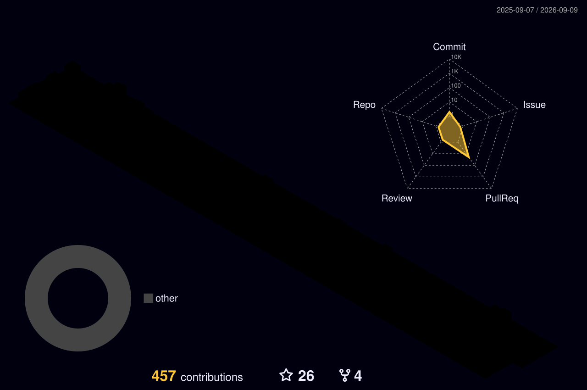

<h1 align="center">
  <b>Prabhav Khera</b>
</h1>

Software Engineer on the Insights team at **Cresta**. Computer Science, **University of Waterloo**.
I build developer tooling and internal systems, mostly in Go, TypeScript, and Python.

## What I'm building

- **MRCOG Courses CRM** — custom CRM with WhatsApp API integration, bulk email, and pipeline management.
- **Telegram bot suite** — automated bots for course management and utilities.

## Stack

  

## Contributions

  

---

Outside work: landscape photography around Toronto, single-player RPGs, and following FC Barcelona and the Blue Jays.
