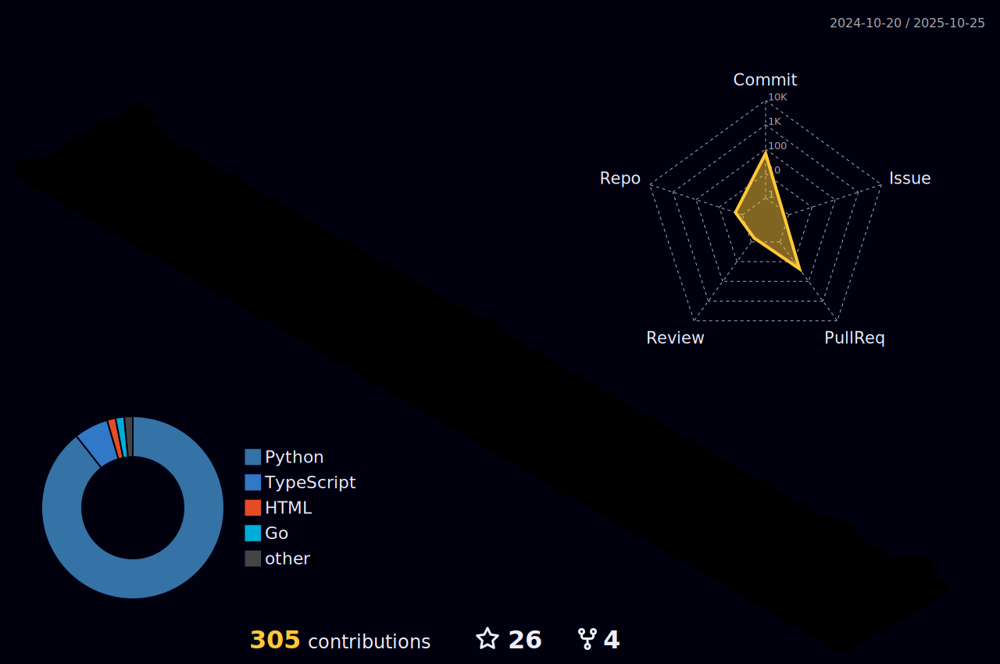

<h1 align="center">
  <b>Prabhav Khera</b>
</h1>
<!--  -->

Hey! I'm Prabhav Khera, candidate of **B. Computer Science(BCS) with Artificial Intelligence Specialization** at University of Waterloo.

## My Stats

 

  

 

  

 

  

    
  

  

   
<!--      -->
    
  

  

